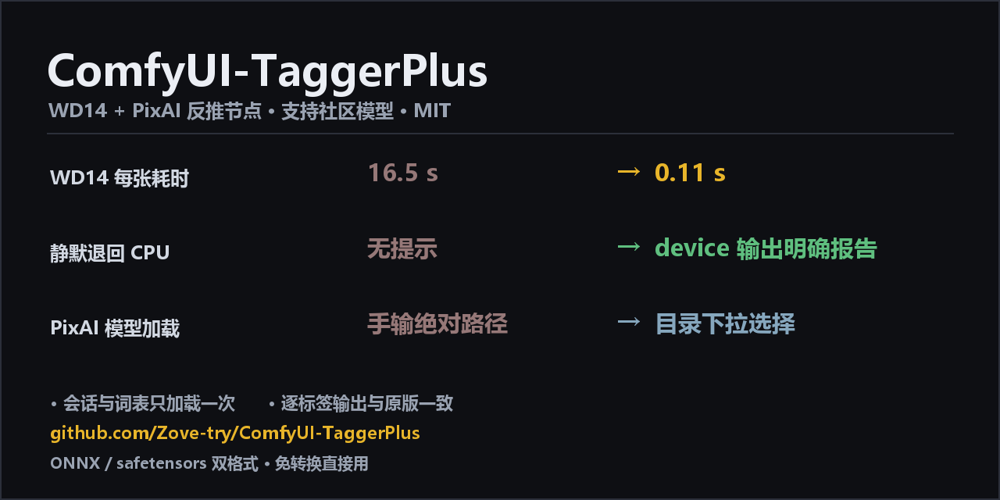

# ComfyUI-TaggerPlus



ComfyUI 的 WD14 / PixAI 图像反推节点，解决了原版节点在性能与易用性上的几个已知问题。

 

---

## 与原版节点的主要差别

| 项目 | 原版 | 本插件 |
|---|---|---|
| **WD14 速度** | `ComfyUI-WD14-Tagger` 每次执行都重新创建 `InferenceSession`（重新加载 1.2 GB 模型） | 会话与词表只加载一次 |
| **设备可见性** | CUDA provider 加载失败时静默退回 CPU；日志只打印「请求的 provider」，不打印「实际生效的 provider」 | `device` 输出直接给出实际设备：`GPU · RTX 5060 Ti` 或 `CPU ⚠ …` |
| **PixAI 模型加载** | `model_file` / `config_file` 为文本框，需填绝对路径 | 从 `ComfyUI/models/pixai_tagger/` 自动扫描，下拉选择 |
| **社区模型** | 仅支持 NHWC 布局的 ONNX | 支持 ONNX（自动适配 NHWC / NCHW）与 safetensors + timm，无需导出转换 |

## 安装

```bash
cd ComfyUI/custom_nodes
git clone https://github.com/Zove-try/ComfyUI-TaggerPlus
```

也可以用 ComfyUI-Manager 的「Install via Git URL」。重启 ComfyUI 后，节点出现在 **TaggerPlus** 分类下。

仓库本体为纯代码（约 60 KB），模型与 CUDA 运行库均按需获取，见下文。

## 节点

### WD14 Tagger Plus

- 输入：`image`、`model`（下拉）、`threshold`、`character_threshold`、`device`
- 输出：`tags`(STRING)、`device`(STRING，实际使用的设备)
- 可选：`replace_underscore`、`escape_parens`、`sort_by_confidence`、`trailing_comma`、`exclude_tags`、`color_order`、`preprocess`
- 支持的模型格式（自动识别）：
  - `.onnx` + 词表 csv —— 自动适配 NHWC / NCHW 布局
  - `<名字>/model.safetensors` + `config.json` + 词表 —— 社区模型（timm）

与原版的默认行为差异：

| 参数 | 原版 | 本插件 | 说明 |
|---|---|---|---|
| `escape_parens` | 强制开启 | 默认关闭 | 原版把 `(` `)` 转成 `\(` `\)`，会让下游按标签查表的节点匹配失败 |
| `sort_by_confidence` | 无此参数（词表顺序） | 默认关闭 | 与原版顺序一致；开启后按置信度降序 |
| `exclude_tags` | 大小写敏感 | 大小写不敏感 | 下划线与空格两种写法都匹配 |

### PixAI Tagger Plus

- 输入：`image`、`model`（下拉）、6 个类别阈值、`threshold_mode`、`device` 等
- 输出：与原版相同的 7 个 STRING，另加 `device`
- 模型从 `ComfyUI/models/pixai_tagger/` 自动扫描

## 社区模型支持

社区新模型通常只发布 PyTorch 权重（`model.safetensors`），没有 ONNX；即使自行导出，也容易导出成 NCHW 布局而无法在原版节点上运行。本插件对两种格式都做了适配：

| 格式 | 目录结构 | 处理方式 |
|---|---|---|
| ONNX（WD v1.4 / v3） | `models/wd14_tagger/<名字>.onnx` + 词表 csv | 自动识别 NHWC / NCHW 并转置；输出若不是概率（logits）自动补 sigmoid |
| safetensors + timm | `models/wd14_tagger/<名字>/model.safetensors` + `config.json` + `selected_tags.csv` | 按 `config.json` 的架构用 timm 加载 |

### 预处理约定

社区模型多从 [SmilingWolf/wd-eva02-large-tagger-v3](https://huggingface.co/SmilingWolf/wd-eva02-large-tagger-v3) 微调而来，沿用 WD 的两条约定。不遵循时输出会明显错误：

| 约定 | 正确做法 | 偏离后的实测结果 |
|---|---|---|
| 通道顺序 | **BGR**（RGB→BGR 后再归一化，参考 [neggles/wdv3-timm](https://github.com/neggles/wdv3-timm)） | 输入 RGB 时，金发被识别为 `blue_hair`、蓝眼被识别为 `blue_skin`；与 ONNX 路径一致率 43.8% |
| 构图 | **长边缩放到 448，再补白边成正方形** | 改用 ImageNet 式「短边缩放 + 中心裁剪」会裁掉头/脚，丢失 `blue_eyes`、`blue_halo`、`blue_ribbon`，并误报 `head_out_of_frame`；一致率 50% |

两项均正确时，同一份权重的 safetensors 与 ONNX 路径一致率为 **98.5%**（实测同一张图 65 与 64 个标签）。

节点保留 `color_order`（auto/bgr/rgb）与 `preprocess`（auto/pad/crop）两个可选项，用于适配特殊模型。

### 已适配：wd-eva02-tagger-2026-canary

下拉中选择 `⬇ wd-eva02-tagger-2026-canary (需下载)` 即可自动下载（权重 + config + 词表，约 1.2 GB）。

| 项目 | 值 |
|---|---|
| 来源 | [ashen-sensored/wd-eva02-tagger-2026-canary](https://huggingface.co/ashen-sensored/wd-eva02-tagger-2026-canary) |
| 许可 | Apache-2.0 |
| 架构 | `eva02_large_patch14_448`（timm），320M 参数 |
| 标签数 | 16,473（比 WD v3 eva02-large 的 10,861 多 5,999 个：2,205 角色 + 3,794 通用） |
| 训练数据截止 | 2026-05-18（WD v3 为 2024-02） |
| 官方建议阈值 | 0.6094（P=R 点） |

### 手动放置社区模型

```
ComfyUI/models/wd14_tagger/wd-eva02-tagger-2026-canary/
├── model.safetensors
├── config.json
└── selected_tags.csv
```

镜像地址（国内直连）：

```
https://hf-mirror.com/ashen-sensored/wd-eva02-tagger-2026-canary/resolve/main/model.safetensors
https://hf-mirror.com/ashen-sensored/wd-eva02-tagger-2026-canary/resolve/main/config.json
https://hf-mirror.com/ashen-sensored/wd-eva02-tagger-2026-canary/resolve/main/selected_tags.csv
```

safetensors 格式需要 `timm`（ComfyUI 环境通常已自带；缺失时执行 `pip install timm`）。缺少 timm 时仅社区模型不可用，ONNX 模型不受影响。

## 模型下载

### 自动下载

下拉列表中带 `⬇` 的条目在首次使用时自动下载：

```
model 下拉示例：
  wd-eva02-large-tagger-v3                 ← 已安装
  ⬇ wd-swinv2-tagger-v3  (需下载) · 446 MB · 较快
  ⬇ wd-vit-tagger-v3     (需下载) · 361 MB · 最快
  ⬇ wd-v1-4-moat-tagger-v2 (需下载) · 311 MB · 旧版 v1.4，可作对照
```

下载源先尝试 HuggingFace 官方，失败自动切换到 hf-mirror.com 镜像。下载过程使用 `.part` 临时文件与原子改名，中断不会留下损坏文件。

#### 下载进度

- 网页 UI：节点上显示进度条（ComfyUI 官方 `comfy.utils.ProgressBar`，按 MB 推进）
- 控制台：至少每 3 秒输出一行，包含百分比、已下载/总量、实时速度与剩余时间

```
[TaggerPlus] 需要下载模型 wd-vit-tagger-v3（361 MB），共 2 个文件，依次尝试 2 个下载源
[TaggerPlus] 使用下载源：https://huggingface.co
[TaggerPlus] 文件 1/2：model.onnx
[TaggerPlus] 开始下载 wd-vit-tagger-v3 · model.onnx（361.0 MB） → wd-vit-tagger-v3.onnx
[TaggerPlus]   下载中  42.3%  152.7 MB / 361.0 MB  4.8 MB/s  剩余约 00分43秒
[TaggerPlus] 下载完成 wd-vit-tagger-v3.onnx  361.0 MB  用时 75.2s  平均 4.8 MB/s
[TaggerPlus] 文件 2/2：selected_tags.csv
[TaggerPlus] ✓ 模型就绪：wd-vit-tagger-v3 → ComfyUI/models/wd14_tagger
```

加载模型与创建 ONNX 会话同样会输出状态行。

可自动下载的模型：

| 模型 | 体积 | 说明 |
|---|---|---|
| `wd-eva02-large-tagger-v3` | 1.2 GB | 准确率最高 |
| `wd-swinv2-tagger-v3` | 446 MB | 较快 |
| `wd-convnext-tagger-v3` | 377 MB | 较快 |
| `wd-vit-tagger-v3` | 361 MB | 最快 |
| `wd-v1-4-moat-tagger-v2` | 311 MB | 旧版 v1.4，适合作版本对照 |
| `wd-eva02-tagger-2026-canary` | 1.2 GB | 社区模型，训练截止 2026-05 |
| `pixai-tagger-v1.0`（PixAI 节点） | 1.9 GB | 官方 v1.0 |

### 下载失败时的替代方式

**A. 指定镜像**

```powershell
# Windows（当前会话）
$env:TAGGERPLUS_HF_ENDPOINT = "https://hf-mirror.com"
```
```bash
# Linux / macOS
export TAGGERPLUS_HF_ENDPOINT=https://hf-mirror.com
```

也可以在插件目录的 `taggerplus_dirs.json` 中配置：

```json
{ "hf_endpoint": "https://hf-mirror.com" }
```

**B. 手动下载**

| 文件 | 地址 |
|---|---|
| WD14 权重 | `https://hf-mirror.com/SmilingWolf/wd-eva02-large-tagger-v3/resolve/main/model.onnx` |
| WD14 词表 | `https://hf-mirror.com/SmilingWolf/wd-eva02-large-tagger-v3/resolve/main/selected_tags.csv` |
| PixAI 权重 | `https://hf-mirror.com/pixai-labs/pixai-tagger-v1.0/resolve/main/model.safetensors` |
| PixAI 配置 | `https://hf-mirror.com/pixai-labs/pixai-tagger-v1.0/resolve/main/config.json` |

（将 `hf-mirror.com` 换成 `huggingface.co` 即为官方源）

放置位置：

```
ComfyUI/models/wd14_tagger/
├── model.onnx
└── selected_tags.csv

ComfyUI/models/pixai_tagger/pixai-tagger-v1.0/
├── model.safetensors
└── config.json
```

文件名保持原样即可：插件同时识别 `<模型名>.csv` 与 `selected_tags.csv`。若希望下拉中显示更清晰，可将 `model.onnx` 改名为 `wd-eva02-large-tagger-v3.onnx`（此时词表需改名为 `wd-eva02-large-tagger-v3.csv`）。

### CUDA 运行库（可选）

`onnxruntime-gpu` 的 CUDA provider 需要 CUDA 12 运行库（`cublasLt64_12.dll`），而 ComfyUI 便携包中的 torch 通常为 CUDA 13（`cublasLt64_13.dll`），文件名不匹配时 CUDA provider 加载失败并退回 CPU。

先运行一次节点，查看 `device` 输出：

| 输出 | 含义 | 处理 |
|---|---|---|
| `GPU · NVIDIA GeForce RTX xxxx` | 已使用 GPU | 无需安装 |
| `CPU ⚠ 请求了 GPU 但回退到 CPU` | 缺少 CUDA 12 运行库 | 按下述任一方式安装 |

创建 ONNX 会话前，插件会依次扫描以下位置，命中任意一处即使用 GPU：

1. `site-packages/nvidia/*/bin` —— 安装过 `nvidia-*-cu12` 时
2. `torch/lib` —— 若 torch 为 CUDA 12 版本（cu121 / cu124 / cu126），此处已包含所需 DLL
3. `<插件目录>/cuda12/` —— 下述两种方式的安装位置

#### 方式 A：离线包（夸克网盘）

> 下载地址：https://pan.quark.cn/s/77632a836e96
> 文件名：`ComfyUI-TaggerPlus_CUDA12运行库_Windows.zip`
> 大小：787 MB（解压后约 1.1 GB）
> SHA256：`287643aa255738c49ead59e2d3dc7562879d4bebb6a0ef1a7d221936de607df5`
> 适用平台：Windows（Linux / macOS 请用方式 B）

将压缩包内的 `cuda12` 文件夹整体解压到插件目录，与 `nodes`、`vendor` 同级：

```
ComfyUI/
└── custom_nodes/
    └── ComfyUI-TaggerPlus/
        ├── nodes/
        ├── vendor/
        ├── __init__.py
        └── cuda12/
            └── nvidia/
                ├── cublas/bin/cublasLt64_12.dll
                ├── cuda_runtime/bin/cudart64_12.dll
                ├── cufft/bin/cufft64_11.dll
                └── curand/bin/curand64_10.dll
```

解压后的最终路径应为 `ComfyUI-TaggerPlus/cuda12/nvidia/cublas/bin/cublasLt64_12.dll`。若出现 `cuda12/cuda12/nvidia/...` 说明多了一层目录，将内层目录上移即可。

#### 方式 B：脚本安装

| 平台 | 操作 |
|---|---|
| Windows | 双击插件目录下的 `install_cuda12.bat` |
| Linux / macOS | `bash install_cuda12.sh` |

脚本会定位 ComfyUI 的 python（优先便携包路径），将 4 个 NVIDIA 运行库安装到 `<插件目录>/cuda12/` 并校验结果。

运行库不随仓库分发：解压后约 1.1 GB，超过 GitHub 单文件限制，且 NVIDIA 运行时库应通过官方渠道获取。删除 `cuda12/` 目录即可撤销，不影响其他组件。

## 性能

### 原版节点的耗时构成

原版节点处理三张不同图片的实测耗时为 `16.50s / 16.47s / 16.21s`，三者几乎相同，说明每次都在支付固定的重复成本。分项如下：

| 环节 | 耗时 | 原因 |
|---|---|---|
| 磁盘顺序读取 1.2 GB 模型 | 0.55 s | 无影响（2,199 MB/s） |
| 解析 10,861 行词表 | 0.01 s | 无影响 |
| **创建 ONNX 会话** | 3 – 6 s | 原版每次执行都重建 |
| **推理（448²）** | CPU 约 1.6 s / GPU 约 0.1 s | 取决于 provider |

其中影响最大的一项是 CUDA provider 的静默降级：ORT 仅在 stderr 输出一行警告，节点日志中不可见。

### 实测对比（RTX 5060 Ti）

| | 原版节点 | TaggerPlus |
|---|---|---|
| WD14 首次 | 16.50 s | 冷启动 10–50 s（加载 CUDA 运行库并创建会话，每个进程一次） |
| WD14 之后每张 | 16.47 s | **0.09 – 0.20 s**（GPU）/ 约 1.6 s（CPU） |
| PixAI 首次 | 5.92 s | 3.7 s |
| PixAI 之后每张 | 0.61 s | **0.55 s** |
| 社区模型（canary，320M） | 不支持 | 0.20 – 0.22 s |

93 张图仅导出标签：约 25 分钟 → 约 1 分钟。

## 兼容性

与上游节点在同一张图片上做过逐标签比对（`escape_parens=True` 以对齐原版行为）：

| 节点 | 结果 |
|---|---|
| WD14 Tagger Plus vs `WD14Tagger\|pysssss` | 输出字符串完全相同 |
| PixAI Tagger Plus vs `PixAITagger` | 输出字符串完全相同 |

## 许可与署名

- 本插件：MIT
- `vendor/pixai_vitdet.py`（PixAI 模型架构与预处理）取自
  [sln77/ComfyUI-Tagger](https://github.com/sln77/ComfyUI-Tagger)（MIT, Copyright (c) 2026 sln77），
  许可证原文见 `vendor/LICENSE.ComfyUI-Tagger.txt`
- PixAI Tagger v1.0 权重：[pixai-labs/pixai-tagger-v1.0](https://huggingface.co/pixai-labs/pixai-tagger-v1.0)（Apache-2.0）
- WD 系列权重：[SmilingWolf](https://huggingface.co/SmilingWolf)（各仓库各自许可）

---

## English

Two fixed tagger nodes for ComfyUI.

- **WD14 Tagger Plus** — upstream `ComfyUI-WD14-Tagger` rebuilds the ONNX `InferenceSession` on every
  execution (1.2 GB reload) and silently falls back to CPU when the CUDA provider fails to load.
  This node caches the session and vocabulary, and reports the device actually used as an output.
  It accepts both ONNX (auto-adapting NHWC / NCHW) and safetensors + timm community models.
- **PixAI Tagger Plus** — upstream requires absolute model paths. This node scans
  `ComfyUI/models/pixai_tagger/` and provides a dropdown.

Windows users who need the CUDA 12 runtime can use the offline package (787 MB) from
[Quark Drive](https://pan.quark.cn/s/77632a836e96) and unzip its `cuda12/` folder into the plugin
directory; Linux/macOS users can run `install_cuda12.sh`.

Outputs are identical to the upstream nodes (verified label by label). MIT licensed; the PixAI
architecture code is vendored from [sln77/ComfyUI-Tagger](https://github.com/sln77/ComfyUI-Tagger)
with attribution.

## FAQ

<details>
<summary><b>不安装 CUDA 运行库会怎样？</b></summary>

功能不受影响，仅速度下降：

| | 第 1 张 | 第 2 张 | 第 3 张 | 标签结果 |
|---|---|---|---|---|
| 有 CUDA 运行库（GPU） | 2.33 s | 0.09 s | 0.17 s | — |
| 无（自动退回 CPU） | 4.01 s | 1.64 s | 1.89 s | 与 GPU 逐字节相同 |

单张耗时从约 0.1 秒变为约 1.6 秒（10–20 倍）。`device` 输出会标记
`CPU ⚠ 请求了 GPU 但回退到 CPU`。代价是 CPU 占用，会与 ComfyUI 中的其他 CPU 任务竞争资源。

即使不安装运行库，相对原版节点仍有明显提升（原版 16.5 s/张 → 本插件约 1.6 s/张），
因为省去了每张图重建 ONNX 会话的开销。
</details>

<details>
<summary><b><code>device</code> 显示 <code>CPU ⚠ …</code>，如何排查？</b></summary>

依次检查：

1. `cuda12/nvidia/cublas/bin/cublasLt64_12.dll` 是否存在（多一层 `cuda12/` 是常见错误）
2. 是否重启了运行 8188 端口的 ComfyUI 进程（仅关闭网页不算）
3. 控制台（而非节点界面）中是否有 ORT 相关报错
4. 若 torch 为 CUDA 12 版本，检查 `torch/lib/cublasLt64_12.dll` 是否存在，存在则无需安装
</details>

<details>
<summary><b>首次运行为什么需要几十秒？</b></summary>

首次创建 CUDA 会话需要从磁盘读入约 1 GB 的 CUDA 运行库并初始化，冷启动约 10–50 秒。
之后会话被缓存，每张图约 0.07–0.2 秒；热缓存下创建会话约 1.8 秒。
</details>

<details>
<summary><b>输出与原版是否一致？</b></summary>

一致。将 `escape_parens` 设为 `True` 对齐原版行为后，输出字符串完全相同。
默认关闭括号转义，是为了让下游按标签查表的节点正常工作（原版会把 `(` `)`
转成 `\(` `\)`，导致 `xxx_(series)` 这类标签匹配失败）。
</details>

<details>
<summary><b>模型必须放在 models 目录吗？</b></summary>

不是。插件默认也会扫描 `custom_nodes/ComfyUI-WD14-Tagger/models/`（WD14），
并可在插件根目录创建 `taggerplus_dirs.json` 指定任意目录：

```json
{
  "pixai_tagger": ["E:/pixai-tagger"],
  "wd14_tagger": []
}
```
</details>
